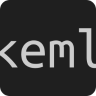

# KEML

**KEML — Actions over abstractions.**  
_Enhance HTML with expressive, declarative attributes that connect your frontend
directly to your server logic._

---

HATEOAS for HTML.

KEML keeps the server in control and expresses UI behavior through declarative
attributes in markup.

It’s not a frontend framework, and it’s not a client-side DSL. The browser stays
simple. The server decides everything that matters.

---

The documentation is full of interactive demo applications.

See you there: https://thealjey.github.io/keml/
