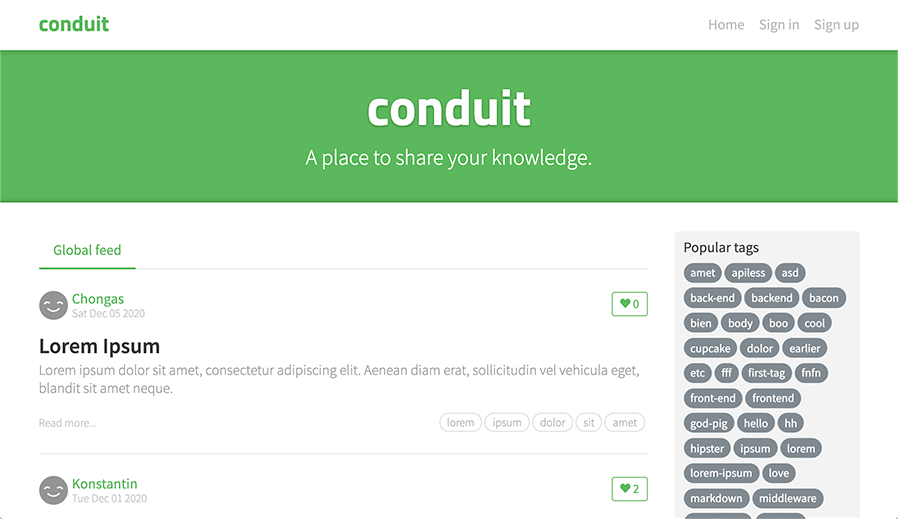

# KEML RealWorld Demo

This is a [**RealWorld app**](https://docs.realworld.show/introduction/)
reference implementation powered by KEML. It follows the standard RealWorld spec
and includes all expected features, such as:

- User authentication (sign up, log in/out)
- Creating, editing, deleting, and viewing articles
- Commenting on articles
- Favoriting and unfavoriting articles
- Viewing articles by author or tag
- Profile pages with follow/unfollow
- Pagination and feeds

The purpose of this demo is to showcase **KEML’s declarative browser behavior**
in a full-featured real-world application scenario.



---

## Getting Started

Start the demo with:

```bash
npm run demo:realworld
```

---

## Server Dependencies

The server is written in Python. Install the required packages with:

```bash
npm run pip:install
```

> Note: If you want to avoid installing packages globally, create a virtual
> environment before running the command.

---

## How It Works

- The Python server serves HTML templates and static files.
- All dynamic behavior is handled **in the browser** via KEML attributes.
- There are no frontend dependencies or build steps; just open the demo in a
  browser after starting the server.
- KEML makes it trivial to implement server-driven updates (via SSE or XHR) and
  client-side interactivity without any framework boilerplate.

---

## Features

- **Articles** – Create, edit, delete, favorite, and filter by tag or author.
- **Comments** – Add and remove comments in real time.
- **Authentication** – Sign up, log in, and log out with JWT-based cookies.
- **Profiles** – View profiles, follow/unfollow users.
- **Pagination & Feeds** – Browse articles with standard feeds and page
  controls.

All interactions behave exactly like the canonical RealWorld implementation,
with KEML powering the frontend logic.

---

## Notes

- This demo is structured for **quick experimentation and learning**.
- The Python server is only there to serve the application; the core of KEML
  functionality lives entirely in the browser.
- No npm frontend dependencies are required.
