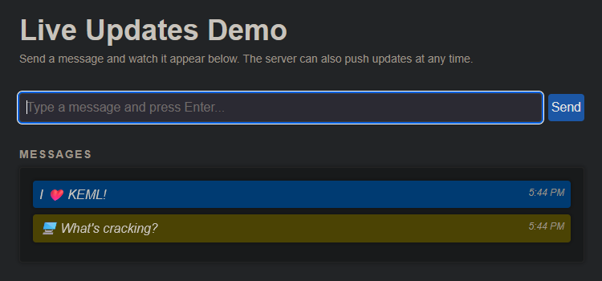

# KEML SSE Demo

This is a live updates demo powered by KEML. It showcases server-driven updates
that are broadcasted across multiple clients.



---

## Getting Started

Start the demo with:

```bash
npm run demo:sse
```

---

## Server Dependencies

The server is written in Python. Install the required packages with:

```bash
npm run pip:install
```

> Note: If you want to avoid installing packages globally, create a virtual
> environment before running the command.

---

## How It Works

- The Python server serves static HTML snippets and files.
- All dynamic behavior is handled **in the browser** via KEML attributes.
- Messages submitted through the form are sent to the server and broadcast
  to all connected clients via SSE.
- The server also emits periodic messages independently of user input.
- Incoming updates are appended to the message list without reloading the page.

---

## Features

- **Shared Updates** – Messages are visible to all connected users.
- **Server Push** – The server can emit messages at any time.
- **User Input** – Messages are sent via a simple form.
- **Auto-Scroll** – New messages are revealed automatically.

This demo highlights how KEML enables **server-driven UI updates** using plain
HTML, without any frontend framework.

---

## Notes

- This demo is structured for **quick experimentation and learning**.
- The Python server only facilitates the demo; KEML itself runs entirely in the
  browser.
- No npm frontend dependencies are required.
