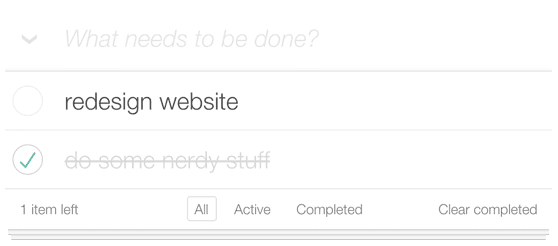

# TodoMVC Demo (KEML)

This is a [**TodoMVC app**](https://todomvc.com/) implemented using **KEML**.
It is a standard TodoMVC application designed to showcase the framework-agnostic
behavior of TodoMVC, powered by KEML for declarative updates in the browser.



---

## Features

- Add new todos
- Edit existing todos
- Mark todos as completed or active
- Delete todos
- Filter todos by **All**, **Active**, or **Completed**
- Clear all completed todos

---

## Getting Started

### Install Python dependencies

```bash
npm run pip:install
```

> If you prefer not to install packages globally, create a Python virtual
> environment before running this command.

### Run the demo

```bash
npm run demo:todo
```

This will start the local Python server and open the TodoMVC demo in your
default browser.

---

## User Interface

- **Add Todos:** Enter text in the input field and press Enter.
- **Toggle Completion:** Click the checkbox next to a todo.
- **Edit Todos:** Double-click a todo item to edit.
- **Delete Todos:** Click the `×` button next to a todo.
- **Filter Todos:** Use the **All / Active / Completed** links to filter.
- **Clear Completed:** Click the “Clear completed” button to remove all
  completed todos.

---

## Notes

- The Python server is included only to run the demo. Python itself is
  irrelevant to KEML.
- The focus of this demo is the **reactive UI behavior**, not server-side logic.
